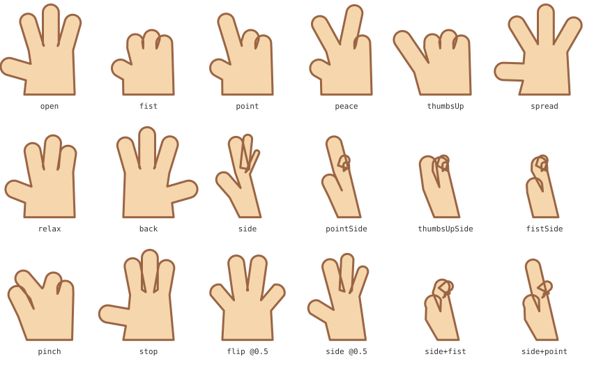
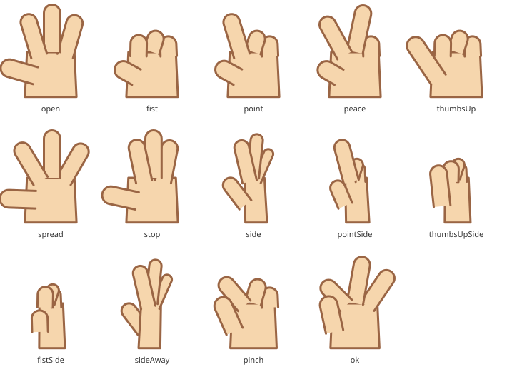

# Hand representations — a side view, and more of them

*Study for VNX-22 (parked "pending a fresh look at how hands are drawn"),
reopened. Nothing in this document is shipped; it says what the hands can and
cannot become, and how to get there without breaking what already works.*

> « Il va falloir qu'on fasse une évolution des mains afin d'avoir une vue de
> côté et un maximum d'autres types de représentation de la main. »

The reference is a cartoon hand set: the same hand drawn a dozen ways — palm
open, back of the hand, fist, pointing, thumbs up, OK, pinch, holding
something, waving — and, crucially, several of those **in profile**. The
classic thumbs-up and the classic pointing hand are side views. Boop's hands
are drawn from the front only, so the two gestures a mascot makes most often
are the two it draws least convincingly.

```text
Today                        Reference set
─────────────────────        ──────────────────────────────────────────
one outline, palm view       palm · back · profile (thumb near / far)
6 poses + curls + grip       fist · point · thumbs up · OK · pinch · stop
flip = mirrored outline      holding · waving · counting · rock …
```

## 1. What a hand is today

Implementation, in the order a frame meets it (`docs/HAND_RIGGING.md`):

| Layer | Where | What it knows about the drawing |
| --- | --- | --- |
| Generator | `core/sample/hand-artwork.js` | **one `<path>` per hand**: wrist → thumb → index → middle → ring → wrist, each digit `L L A L`. `handPath()` draws the open hand and every pose from one template |
| Install | `core/sample/hand-feature.js` | writes both paths, the `hands` block, a `restPath`, **12 shape keys per hand** (6 poses, 4 curls, grip, flip), their parameters, a Wave clip — one undo step |
| Rig record | `core/hands/hand-model.js`, `runtime/hands.js` | `element` (one id), `parent`, `anchor`, `restOffset`, `reach`, `softness`, `depth`, `parameters`, `poses[]`, `inertia`. A pose is `{ id, parameter, shapeKey \| variant }` |
| Runtime | `runtime/hands.js` → `compileRigFrame` | offset + anchor drift + rotation + scale on `frame[hand.element]`; a pose adds a **shape-key weight on that same entry** (method A) or scales a variant's **opacity** (method B) |
| Handles | `core/puppet/hand-handles.js` | place, turn, grip, flip, four fingertips (`handDigitTip`, same geometry as the outline); hand mode draws anchor and reach |
| Panel | `rig-editor/hands/hand-setup-panel.js` | artwork, anchor, pose chips, Fingers, Motion, Physics, Advanced (depth, shape / variant wiring). 44 control hooks pinned by `disclosure.test.js` |
| Words | `ui/control-catalog.js` | reads the `hand[LR]Suffix` naming rule back: Transform · Shape (Grip, Flip) · Fingers · Poses |
| Elsewhere | reactions (`gestures`), `attachment-model.js` (fingertips), `automatic-presets.js` (hand drift), `mascot-presets.js`, `rig-validator.js` (`hands` domain), `mirrorHand` |

Two facts about this stack decide the study.

**The whole hand is one outline.** A shape key is a per-point delta, so a pose
is only possible when its path has the *same command layout* as the rest path:

```text
M L L A L  L L A L  L L A L  L L A L  L Z        19 commands, 56 numbers
  ╰thumb╯  ╰index╯  ╰middle╯ ╰ring╯
```

Everything that ships keeps that layout by construction — that is the whole
point of generating the poses. It also means:

* no line can be drawn *inside* the silhouette — a fist has no finger
  separations, a palm no creases, a profile no thumb-over-palm edge;
* two digits cannot overlap: the outline visits each digit once, left to right,
  so an overlap becomes a visible self-intersection of the stroke;
* a hole (the OK sign) is a second sub-path, which is a different layout;
* **`handLFlip` is a mirror**, and the midpoint of a linear mirror is a hand
  folded onto its own axis (figure 1, `flip @0.5`). A turn that passes through
  a real profile is not expressible on one outline.

**Method B exists but is half built.** A pose may name a `variant` — other
artwork cross-faded in as the neutral hand fades out — and the panel, model,
validator and runtime all carry it. But `evaluateHands` moves only
`frame[hand.element]`; the variant receives an opacity and **no transform**, so a
variant drawn anywhere but exactly under the neutral hand stays where it was
drawn while the hand reaches, turns and bounces. Nothing generates variants,
and no test exercises one that moves. It is the right mechanism for a set of
*drawings* (section 5, option B) once it follows the hand.

## 2. Feasibility spike

Two throwaway generators were written against the real `hand-artwork.js` and
`runtime/path-vector.js`, and their output rendered in Chromium. The figures are
in `docs/figures/`; the numbers below are what `pathsCompatible` reported.

### 2.1 One outline, three more knobs

`handPath` was given a palm width and skew, a per-digit sideways `shift` along
the knuckle line and a per-digit `width` scale. None of them adds or removes a
command, so **every candidate view kept the layout** and could be stored as a
shape key today: `side`, `pointSide`, `thumbsUpSide`, `fistSide`, `pinch`,
`stop`, and the blends `side @0.5`, `side + fist`, `side + point`.



*Figure 1. Row 1 and `relax`/`back`: what ships. The rest: the same outline
asked for a profile.*

Compatible is not the same as drawable. Every profile is a tangle: the stacked
fingers cross the outline's own stroke, the thumb over the palm draws its edge
through the palm, `stop` (fingers together) overlaps its neighbours, and adding
the `side` delta to the `fist` delta gives neither. The single outline is the
right representation for a **front** hand with separated digits, and nothing
else. Extending the generator's vocabulary (option A below) buys a few more
front poses and no side view worth shipping.

### 2.2 The same hand as parts

```text
handLeft  (g)                        paint order, back → front
 ├─ handLeftPalm     M L L L Z       palm
 ├─ handLeftRing     M L A L         ring     ─┐ open capsules: the base edge is
 ├─ handLeftMiddle   M L A L         middle    │ unstroked, so a digit's root
 ├─ handLeftIndex    M L A L         index     │ merges into the palm with no
 └─ handLeftThumb    M L A L         thumb    ─┘ line across it
```

Five paths, each with a fixed layout of its own. The same fourteen poses were
generated with per-part shape keys in mind — **every part kept its layout in
every pose** — and rendered in that paint order:



*Figure 2. Front poses gain finger separations and real occlusion (`fist`,
`stop`); the four profiles read as profiles; `sideAway` is `side` with the
thumb painted **behind** the palm — a depth, not a shape; `ok` and `pinch`
are possible because a digit may cross another.*

The profile geometry itself wants an artist's pass (the thumb should lie across
the narrow palm rather than beside it) — that is tuning of numbers in one table,
not architecture. What the spike settles is the architecture: **a side view and
most of the reference set need parts; none of them needs a new runtime
concept.** Parts are elements, poses are shape keys with drivers, occlusion is
paint order by depth band, and all three already exist.

## 3. Which representations become reachable

| Representation | Today | Parts (stage 1) | Facing axis (stage 2) | Drawings (stage 4) |
| --- | --- | --- | --- | --- |
| Open palm, spread, relax, peace | ✔ | ✔ cleaner | | ✔ |
| Fist, point, thumbs up (front) | ✔ as blobs | ✔ with finger lines | | ✔ |
| Back of the hand | ✔ mirror, collapses halfway | ✔ | ✔ through a profile | ✔ |
| Stop (fingers together) | ✗ tangles | ✔ | | ✔ |
| Profile: open, pointing, fist, thumbs up | ✗ | ✔ static | ✔ as a turn | ✔ |
| Profile, thumb away from the viewer | ✗ | ✔ paint order | ✔ | ✔ |
| OK, pinch | ✗ needs a crossing | ✔ | | ✔ |
| Holding an object | ✗ | ✔ fist + fingertip attachments (`rigAttachments` / `rigHolds` already exist) | | ✔ |
| Counting 1–4, rock, "come here" | partly | ✔ from the curl table | | ✔ |
| Any drawing an artist brings (phone, cup, a specific style) | model only | | | ✔ |
| Waving | ✔ rotation clip | ✔ | | ✔ |

## 4. The decision

The project's rule is *80–90 % of the cartoon result for a fraction of the
machinery* (`docs/V2_ROADMAP.md`). Applied here:

| Option | What it is | Verdict |
| --- | --- | --- |
| **A. More poses on the outline** | the three knobs of §2.1, more entries in `HAND_POSE_CURLS` | a handful of extra front poses; **no side view**. Not worth the parameters it adds. Dropped |
| **B. Drawings as variants** | method B: a set of hand drawings, one per representation, cross-faded | exactly how a 2D cut-out animator swaps hands; **the only route for imported artwork**. Cannot be posed further and does not compose. Keep, fix, and offer as the path for "bring your own set" (stage 4) |
| **C. Parts** | five paths per hand, poses as per-part shape keys, depth for occlusion | gives the side view, lines, occlusion, OK and pinch with **no runtime change**. Recommended base (stage 1) |
| **D. A facing axis** | a 1D keyform grid palm → profile → back on top of C, the way the head turns | replaces the collapsing `Flip` with a turn; same machinery as the 2.5D head (3D-06). Recommended on top of C (stage 2) |

**Recommendation: C, then D, and keep B alive for imported sets.** A is where
the current representation runs out, and the spike shows it.

## 5. Target model

### 5.1 A hand is a group

`hand.element` names the `<g>`; the parts are its children and ordinary
elements. Nothing in the `hands` record changes: the schema's `hand` definition
already accepts any element id, `evaluateHands` puts offset, drift, rotation
and scale on the group's frame entry, and SVG carries the children with it.
`HAND_REST_TILT`, the pivot and the mascot-relative scale go on the group, where
the single path had them, so `elements.handLeft.baseTransform.rotation === 200`
stays true.

Ids stay `handLeft` / `handRight` for the group — the e2e selectors, hand mode
(`handRigSide` compares the selected id with `hand.element`), placement,
mirroring and the Artwork card all key on them. Parts are `handLeftPalm`,
`handLeftThumb`, … in the same camel case as the group (shape keys keep their
own `handLeft-fist` style ids; the two are different namespaces).

Projects that already carry a single-outline pair are **not migrated**. Their
`element` is a path, their twelve keys target it, and every function above
treats "the element" opaquely. Same rule as legacy morphs: an old project keeps
rendering through the path it has until its author chooses to redraw the pair.

### 5.2 A pose is a parameter that drives keys on several parts

Today a pose *carries* one key (`pose.shapeKey`) and the runtime adds its weight
to the hand element's `shapeWeights`. With parts that weight would land on the
group and reach no path. The curls, grip and flip never used that path: they
are shape keys with a **range driver on the parameter** (`driver: { parameter:
'handLIndex', min: 0, max: 1 }`), evaluated by the shape pass on their own
target. Poses move to the same mechanism — one driven key per part the pose
moves, all on the pose parameter — and `pose.shapeKey` stays `null`.

That needs two editor-side relaxations and no runtime or schema change:

* `handPosePresets` (`hand-handles.js`) and `validateHands` (`rig-validator.js`)
  currently call a pose "ready" only if it has `shapeKey || variant`. Extend the
  test to *anything driven by the pose's parameter*: a shape key with a range
  driver on it, a keyform axis on it, or a variant;
* `mirrorHand` maps `shapeKey` ids through a table the caller supplies. Driven
  keys are mirrored by the generator (it draws both sides itself, as it does
  now); for a hand-authored pose, Mirror copies the driven keys onto the other
  side's parts under the other side's parameter — a small addition in
  `hand-commands.js`'s `mirror`.

Everything downstream is untouched because it only ever saw the parameter:
reactions raise `handRWave`, `setHandPose` writes it, the catalogue names it,
Auto Key keys it, the mixer blends it.

### 5.3 Views are a facing axis

```text
handLFacing   -1        -0.5         0         0.5         1
              back    profile      palm     profile      back
                     (thumb far)           (thumb near)
```

One parameter per hand, five cells, stored as ordinary v4 keyforms — the same
records the head-pose grid writes (`docs/HEAD_POSE_2_5D.md`, 3D-06):

* a `pathShape` keyform per part, weighting that part's *view* shape key
  (`handLeftPalm-side`, `handLeftThumb-back`, …) at each cell;
* a `depth` keyform on the thumb (and on the far fingers): `+0.6` at the near
  profile, `−0.6` at the far profile and the back, so the depth band flips and
  `runtime/draw-order.js` repaints the thumb behind the palm — among the group's
  own children, which is the only place it ever reorders;
* an `opacity` keyform as the fallback where draw order is off
  (`parallax.enabled === false` disables it): the far thumb fades out instead.

Between cells the keyform engine interpolates weights, so palm → profile → back
is a continuous turn through a real profile, not a collapse. The runtime needs
nothing new; `compileRigFrame` already sums `pathShape` weights into
`shapeWeights` before the hands are evaluated and applies `depth` through the
same clamp and hysteresis as the head turn.

`Flip` is what `Facing` replaces. It stays on existing projects and is not
generated for new pairs; the catalogue's `HAND_SHAPE` table gains
`Facing: 'Palm, side or back'`. "Turn" is already taken — the rotation handle
and *Turn range* — so the parameter is not called turn.

A pose in profile is the palm-view pose plus the view delta on each part
(figure 1 shows that sum failing on one outline; on parts the curl of a capsule
is view-independent and only `shift`/`width` differ). If a combination still
reads wrong, the next step is the head pose's own answer: a 2D grid
`pose × facing` with captured corners. Design it only if the render asks for it.

### 5.4 Poses are parametric

With parts, a pose is a table — per digit `{ curl, turn, lift, stretch, shift,
width }`, plus `{ width, skew }` for the palm — and the shape keys are
*generated* from it. That is what unblocks the pose editor VNX-22 wanted:
sliders per digit, a live preview through the same generator, **Capture as
pose** writes the keys and the parameter in one command. No node editing, and
no way to author a pose whose layout does not match. VNX-23 (the gesture
editor) and VNX-24 follow, on a representation that will not change under them.

## 6. Plan, in stages that each leave the app whole

| Stage | Delivers | Touches | Leaves alone |
| --- | --- | --- | --- |
| **0. Method B follows the hand** | `evaluateHands` applies the hand's offset, drift, rotation and scale to `frame[pose.variant].transform` as well; "ready" and the validator accept driven poses | `runtime/hands.js`, `hand-handles.js`, `rig-validator.js`, `hands.test.js` | schema, `hands` record, every exported rig without variants (byte-identical) |
| **1. Parts** | `handParts()` in `hand-artwork.js` beside `handPath()`; `installHands` writes the group, five `restPath`s, driven keys per part for the six poses, four curls and grip; `handDigitTip` reads the same geometry (`root`, `shift`); placement measures the group | `hand-artwork.js`, `hand-feature.js`, `hand-handles.js` (ready test), `attachment-model.js` (nothing: it calls `handDigitTip`), `control-catalog.js` (no change: suffixes are read back) | `hand-model.js`, `hand-commands.js`, `runtime/*`, hand mode, mirror, reactions, catalogue, Auto Key, hand drift |
| **2. Facing** | `handLFacing` with five cells, the view keys and the depth/opacity keyforms, written by `installHands`; a **View** chip row (Palm · Side · Back) in Hand Setup that drives it live like the pose chips; a `hand-{side}-facing` member handle; `Flip` no longer generated | `hand-feature.js`, `hand-setup-panel.js`, `hand-handles.js`, `control-catalog.js`, `disclosure.test.js` hook list | keyform engine, head-pose code, schema |
| **3. Pose editor** (VNX-22 proper) | per-digit sliders + Capture as pose, generated keys, one command; pose create/remove on one surface (the asymmetry noted in `VNEXT_COMPONENTS.md`) | new panel section, `hand-commands.js` (`capturePose`), `hand-feature.js` (the table → keys) | everything that consumes poses |
| **4. Hand sets** | *Use a set of drawings*: import or pick a set, each drawing a variant `<g>` placed at the hand's rest, hidden until its pose rises; poses one-hot so two drawings never show at once; mirror by flipping the drawing | `hand-feature.js` (a second installer), `hand-setup-panel.js`, `sanitize-svg.js` (reuse), a built-in set under `core/sample/` | generated hands, runtime (stage 0 did the runtime part) |

Rough sizing, with tests and docs: stage 0 half a day; stage 1 two to three
days; stage 2 two days; stage 3 three to four days; stage 4 two to three days.
Stages 0–2 are one release; 3 and 4 can follow independently.

### What each stage must prove before it lands

* **Unit**: every part of every generated pose keeps its layout
  (`pathsCompatible` per part — the stage-1 version of the test that exists
  today); the fist changes the digits and not the palm; a driven pose reaches
  the artwork through `compileRigFrame` with no `pose.shapeKey`; a variant at
  weight 1 sits where the hand is after a reach; `handLFacing` at `+0.5`
  puts the thumb in the `front` band and at `−0.5` in `behind`; the `Facing`
  cells interpolate (no cell equals the midpoint of its neighbours' collapse);
  export → `normalizeRig` → `createExportRig` round-trips parts and keyforms;
  `validateRig` is empty after `installHands`.
* **e2e** (`ux32-hands.spec.js`): four digit paths under `#handLeft`, each
  with one arc, instead of four arcs on one path; the pose list assertion grows
  with the poses; `handLFist` still shrinks the bounding box; the group still
  moves with `handLX`/`handLY`; undo still removes the pair in one step.
  `ux27-pose-chips.spec.js` counts `SUGGESTED_HAND_POSES` offers (7): keep the
  suggestions or update the count deliberately. `ux39-hand-mode.spec.js` is
  unaffected as long as `hand.element` stays `handLeft`.
* **Budgets** (`docs/RUNTIME_PERFORMANCE.md`): a pair today is 24 keys × 56
  numbers; as parts it is at most 5 targets × ~12 driven keys per hand over
  8- or 13-number vectors — fewer numbers, more targets, and an idle hand still
  costs nothing because `evaluateShapeTarget` returns the cached string when no
  weight moved.

## 7. What must not break, and why it does not

| Contract | Kept by |
| --- | --- |
| Rig schema v4, `hands` / `hand` / `handPose` definitions, `additionalProperties: false` | no new field: parts are elements, poses are parameters with driven keys, views are keyforms |
| Exported runtime for a project without hands, or with single-outline hands | untouched code paths; stage 0's transform copy runs only for poses that name a variant |
| Parameter naming (`handLX`, `handRThumbsUp`, …) and the catalogue that reads it | unchanged; `Facing` is one more suffix in the `Shape` table |
| Reactions' `gestures`, `setHandPose`, the mixer, Auto Key, hand drift | all address the pose **parameter**, never the key |
| Hand mode, placement (VNX-20), mirror, the Artwork card, e2e ids | `hand.element` stays `handLeft` / `handRight` and stays a single node; the group measures like `faceRoot` does |
| One undo step for a pair, for a pose, for a drag | same commands (`hands/add-pair`, `hands/add-pose`, `setAnchor`, `setReach`) |
| Hand Setup's pinned hooks | additions only (`data-hand-view-chip`, `data-hand-facing`); the guard list grows, nothing is renamed |
| Existing projects | never rewritten: a single-outline pair keeps its path, its twelve keys and its `Flip` |

## 8. Open points

* **Selecting a finger.** With parts, a click on the canvas selects
  `handLeftIndex`, not the hand. `handRigSide` should resolve a selected part to
  the hand that contains it, and the gizmo on a part should probably be refused
  (or move the whole hand) the way locked artwork is: moving one finger's base
  transform desynchronises it from its shape keys.
* **The Node tool on a part.** Already generic — a node edit is a linear map
  carried onto `restPath`, every delta and every captured pose — so editing a
  digit's capsule migrates its keys. Adding a point to a digit changes its
  layout, and the existing refusal handles that.
* **The Structure panel** shows a *Left hand* group with five children. Lock
  the parts' names and order by default so the paint order the views rely on is
  not rearranged by hand; the depth reorder only ever permutes rig elements
  through the slots they already occupy, so an author's reorder is respected
  but may put a thumb where a view does not expect it.
* **Profile artwork.** Figure 2's profiles are proof of layout, not final
  drawings. Budget an artist pass on the `side*` tables before stage 2 ships.
* **The reference image** could not be opened from the build sandbox (the
  network proxy refuses `media.istockphoto.com`); the representation list in
  §3 is the standard content of such a set plus the request's own words. Worth a
  five-minute check against the actual sheet before stage 1 fixes the pose
  table.
* **Docs to update when stage 1 lands**: `HAND_RIGGING.md` ("Drawing a pair",
  "Poses and fingers", "Grip and back-of-hand"), `KNOWN_LIMITATIONS.md`
  (the "one outline each" bullet), `USER_GUIDE.md` §Add hands, the
  `VNEXT_ROADMAP.md` rows VNX-22 → 24, `RUNTIME_PERFORMANCE.md` if the budget
  table is regenerated.
